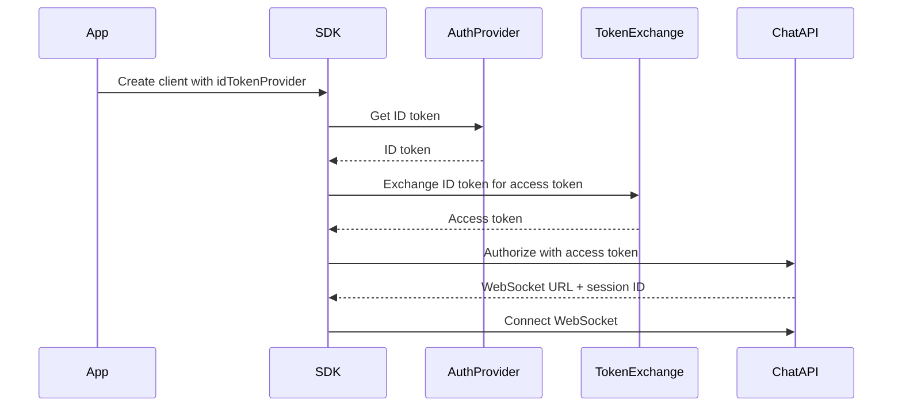

The Sunny Agents SDK supports two authentication modes: authenticated sessions with token exchange, and anonymous mode for local-only conversations.

## Authentication modes

### Authenticated mode

For production applications requiring user authentication:

```typescript
const client = new SunnyAgentsClient({
  idTokenProvider: async () => {
    // Return ID token from your auth provider
    return localStorage.getItem("id_token");
  },
  tokenExchange: {
    partnerName: "your-partner-name",
    audience: "https://api.sunnyhealthai-staging.com",
    clientId: "your-client-id",
  },
});
```

**Features:**

- Server-persisted conversations
- Access token authentication
- Automatic token refresh
- User-specific data

### Anonymous mode

For local-only conversations without authentication:

```typescript
const client = new SunnyAgentsClient({
  websocketUrl: "wss://chat.api.sunnyhealthai-staging.com",
  authorizeUrl: "https://chat.api.sunnyhealthai-staging.com/authorize",
  createServerConversations: false,
});
```

**Features:**

- No authentication required
- Local-only conversations
- Faster setup
- No user data persistence

## Token exchange flow

The SDK uses OAuth 2.0 token exchange to convert ID tokens into access tokens:



### Step-by-step

1. **Provide ID token**: Your app provides an ID token via `idTokenProvider`
2. **Exchange token**: SDK exchanges ID token for access token
3. **Authorize**: SDK uses access token to authorize WebSocket connection
4. **Connect**: SDK establishes WebSocket connection
5. **Refresh**: SDK automatically refreshes token when expired

## ID token providers

### Auth0

```typescript
import { useAuth0 } from "@auth0/auth0-react";

function MyComponent() {
  const { getIdTokenClaims } = useAuth0();

  const client = new SunnyAgentsClient({
    idTokenProvider: async () => {
      const claims = await getIdTokenClaims();
      return claims?.__raw || null;
    },
    tokenExchange: {
      partnerName: "your-partner-name",
      audience: "https://api.sunnyhealthai-staging.com",
      clientId: "your-auth0-client-id",
    },
  });
}
```

### Firebase

```typescript
import { getAuth } from "firebase/auth";

const auth = getAuth();

const client = new SunnyAgentsClient({
  idTokenProvider: async () => {
    const user = auth.currentUser;
    if (!user) return null;
    return await user.getIdToken();
  },
  tokenExchange: {
    partnerName: "your-partner-name",
    audience: "https://api.sunnyhealthai-staging.com",
    clientId: "your-client-id",
  },
});
```

### Custom provider

```typescript
const client = new SunnyAgentsClient({
  idTokenProvider: async () => {
    // Your custom logic to get ID token
    const response = await fetch("/api/get-id-token");
    const data = await response.json();
    return data.idToken;
  },
  tokenExchange: {
    partnerName: "your-partner-name",
    audience: "https://api.sunnyhealthai-staging.com",
    clientId: "your-client-id",
  },
});
```

## Token exchange configuration

```typescript
interface TokenExchangeConfig {
  partnerName: string; // Partner identifier (e.g., "sunny-health-external-mock")
  audience: string; // API audience (e.g., "https://api.sunnyhealthai-staging.com")
  clientId: string; // Auth0 client ID
  tokenExchangeUrl?: string; // Optional, defaults to "https://auth.sunnyhealth.live/oauth/token"
}
```

### Partner name

The partner name is used to construct the subject token type:

```
urn:{partnerName}:id-token
```

Example: `urn:sunny-health-external-mock:id-token`

### Audience

The audience specifies which API the access token is for:

```
https://api.sunnyhealthai-staging.com
```

### Client ID

Your Auth0 client ID for token exchange.

## Automatic token refresh

The SDK automatically refreshes tokens when they expire:

```typescript
// Token is refreshed automatically
// No action needed from your app
```

Token refresh happens:

- Before token expiration
- On authentication errors
- When establishing new connections

## Session management

### Session storage

Sessions are stored in localStorage by default:

```typescript
const client = new SunnyAgentsClient({
  sessionStorageKey: "my_app_session", // Custom key
  // ... other config
});
```

### Session lifecycle

1. **Create**: Session created on first connection
2. **Store**: Session ID stored in localStorage
3. **Reuse**: Session reused on reconnection
4. **Expire**: Session expires after timeout
5. **Refresh**: New session created when expired

## Anonymous mode

For applications that don't require authentication:

```typescript
const client = new SunnyAgentsClient({
  websocketUrl: "wss://chat.api.sunnyhealthai-staging.com",
  authorizeUrl: "https://chat.api.sunnyhealthai-staging.com/authorize",
  createServerConversations: false, // Explicitly disable server persistence
});
```

Or use the `anonymous` option with the widget:

```typescript
attachSunnyChat({
  container: document.getElementById("chat"),
  config: {
    websocketUrl: "wss://chat.api.sunnyhealthai-staging.com",
    authorizeUrl: "https://chat.api.sunnyhealthai-staging.com/authorize",
  },
  anonymous: true, // Enable anonymous mode
});
```

## Error handling

### Authentication errors

```typescript
try {
  await client.sendMessage("Hello!");
} catch (error) {
  if (error.message.includes("token") || error.message.includes("auth")) {
    // Handle authentication error
    console.error("Authentication failed:", error);
    // Redirect to login or show error message
  }
}
```

### Token refresh errors

```typescript
// SDK handles token refresh automatically
// If refresh fails, you'll get an authentication error
```

## Best practices

1. **Secure storage**: Store ID tokens securely (not in localStorage for sensitive apps)
2. **Error handling**: Always handle authentication errors
3. **Token refresh**: Let SDK handle token refresh automatically
4. **Session management**: Use custom session keys for multi-tenant apps
5. **Anonymous mode**: Use anonymous mode for public-facing features

## Examples

### Basic authenticated client

```typescript
const client = new SunnyAgentsClient({
  idTokenProvider: async () => localStorage.getItem("id_token"),
  tokenExchange: {
    partnerName: "my-app",
    audience: "https://api.sunnyhealthai-staging.com",
    clientId: "abc123",
  },
});
```

### With custom token exchange URL

```typescript
const client = new SunnyAgentsClient({
  idTokenProvider: async () => localStorage.getItem("id_token"),
  tokenExchange: {
    partnerName: "my-app",
    audience: "https://api.sunnyhealthai-staging.com",
    clientId: "abc123",
    tokenExchangeUrl: "https://custom-auth.example.com/oauth/token",
  },
});
```

### Anonymous client

```typescript
const client = new SunnyAgentsClient({
  websocketUrl: "wss://chat.api.sunnyhealthai-staging.com",
  authorizeUrl: "https://chat.api.sunnyhealthai-staging.com/authorize",
  createServerConversations: false,
});
```

## Next steps

- **[Authentication Tutorial](/authentication-tutorial)** - Step-by-step authentication setup
- **[Conversations](/conversations)** - Learn about conversation management
- **[Overview](/overview)** - Understand SDK architecture
