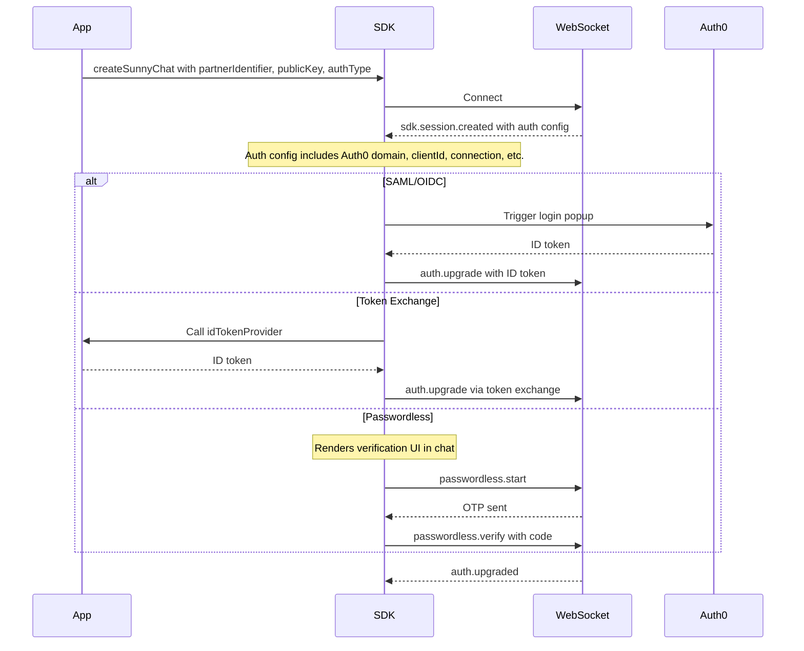
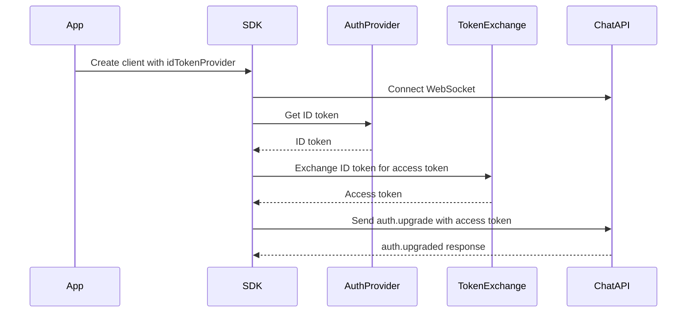

The Sunny Agents SDK supports multiple authentication modes: SAML/OIDC via Auth0, custom token exchange, passwordless authentication, and anonymous mode for local-only conversations. With `createSunnyChat`, all authentication configuration is **server-driven** -- you only specify the auth type and the server provides the necessary Auth0 details automatically.

## Authentication modes

### SAML/OIDC Authentication (Recommended)

For enterprise applications using SAML or OIDC authentication via Auth0:

```typescript
import { createSunnyChat } from "@sunnyhealthai/agents-sdk";

const chat = await createSunnyChat({
  container: document.getElementById("chat"),
  partnerIdentifier: "acme-health",
  publicKey: "pk-sunnyagents_abc_xyz",
  authType: "saml", // or "oidc"
});
```

**Features:**

- Automatic authentication via popup
- No manual token management
- Server-persisted conversations
- Enterprise SSO support
- Modal overlay option for native feel

### Custom Token Exchange

For applications with custom authentication providers:

```typescript
import { createSunnyChat } from "@sunnyhealthai/agents-sdk";

const chat = await createSunnyChat({
  container: document.getElementById("chat"),
  partnerIdentifier: "acme-health",
  publicKey: "pk-sunnyagents_abc_xyz",
  authType: "tokenExchange",
  idTokenProvider: async () => {
    // Return ID token from your auth provider
    return localStorage.getItem("id_token");
  },
});
```

**Or use the headless client directly:**

```typescript
import { SunnyAgentsClient } from "@sunnyhealthai/agents-sdk";

const client = new SunnyAgentsClient({
  idTokenProvider: async () => {
    // Return ID token from your auth provider
    return localStorage.getItem("id_token");
  },
  tokenExchange: {
    partnerName: "your-partner-name",
    audience: "https://api.sunnyhealthai-staging.com",
    clientId: "your-client-id",
    organization: "org_xxx",
  },
});
```

<Tip>
  The `tokenExchange` values (`audience`, `clientId`, `organization`, `tokenExchangeUrl`) come from your [Sunny Central](/partner-setup) SDK config or your Sunny Health representative. Prefer `createSunnyChat` with `authType: "tokenExchange"` when possible — it fetches this config from the server automatically.
</Tip>

**Features:**

- Server-persisted conversations
- Access token authentication
- Automatic token refresh
- User-specific data

### Passwordless Authentication

Email or SMS-based authentication without passwords. The SDK renders a verification UI directly in the chat:

```typescript
import { createSunnyChat } from "@sunnyhealthai/agents-sdk";

const chat = await createSunnyChat({
  container: document.getElementById("chat"),
  partnerIdentifier: "acme-health",
  publicKey: "pk-sunnyagents_abc_xyz",
  authType: "passwordless",
});
```

**Features:**

- Email or SMS authentication
- No passwords required
- WebSocket-based (no page refreshes)
- Optional chat history migration from anonymous to authenticated
- Automatic token management
- In-chat verification UI

### Anonymous mode

For local-only conversations without authentication:

```typescript
import { SunnyAgentsClient } from "@sunnyhealthai/agents-sdk";

const client = new SunnyAgentsClient({
  createServerConversations: false,
});
```

**Features:**

- No authentication required
- Local-only conversations
- Faster setup
- No user data persistence

## Authentication flows

### Server-Driven Configuration Flow

When using `createSunnyChat`, all auth configuration comes from the server:


```mermaid
sequenceDiagram
    participant App
    participant SDK
    participant WebSocket
    participant Auth0

    App->>SDK: createSunnyChat with partnerIdentifier, publicKey, authType
    SDK->>WebSocket: Connect
    WebSocket-->>SDK: sdk.session.created with auth config
    Note over SDK: Auth config includes Auth0 domain, clientId, connection, etc.

    alt SAML/OIDC
        SDK->>Auth0: Trigger login popup
        Auth0-->>SDK: ID token
        SDK->>WebSocket: auth.upgrade with ID token
    else Token Exchange
        SDK->>App: Call idTokenProvider
        App-->>SDK: ID token
        SDK->>WebSocket: auth.upgrade via token exchange
    else Passwordless
        Note over SDK: Renders verification UI in chat
        SDK->>WebSocket: passwordless.start
        WebSocket-->>SDK: OTP sent
        SDK->>WebSocket: passwordless.verify with code
    end

    WebSocket-->>SDK: auth.upgraded
```

### Token Exchange Flow

For custom token exchange with the headless client:


```mermaid
sequenceDiagram
    participant App
    participant SDK
    participant AuthProvider
    participant TokenExchange
    participant ChatAPI

    App->>SDK: Create client with idTokenProvider
    SDK->>ChatAPI: Connect WebSocket
    SDK->>AuthProvider: Get ID token
    AuthProvider-->>SDK: ID token
    SDK->>TokenExchange: Exchange ID token for access token
    TokenExchange-->>SDK: Access token
    SDK->>ChatAPI: Send auth.upgrade with access token
    ChatAPI-->>SDK: auth.upgraded response
```

### Step-by-step

**SAML/OIDC:**
1. **Create chat**: Call `createSunnyChat` with `authType: "saml"` or `"oidc"`
2. **Connect**: SDK connects to WebSocket and receives server auth config
3. **Auto-login**: SDK automatically triggers Auth0 authentication popup
4. **Upgrade auth**: SDK sends `auth.upgrade` message with ID token
5. **Authenticated**: SDK receives `auth.upgraded` response

**Token Exchange:**
1. **Connect**: SDK connects to WebSocket
2. **Provide ID token**: Your app provides an ID token via `idTokenProvider`
3. **Exchange token**: SDK exchanges ID token for access token
4. **Upgrade auth**: SDK sends `auth.upgrade` message with access token
5. **Authenticated**: SDK receives `auth.upgraded` response
6. **Refresh**: SDK automatically refreshes token when expired

## Configuration options

### UnifiedSunnyChatOptions (for createSunnyChat)

```typescript
interface UnifiedSunnyChatOptions {
  container: HTMLElement;              // Required: DOM element for the chat UI
  partnerIdentifier: string;           // Required: Your partner name
  publicKey: string;                   // Required: API key (pk-sunnyagents_...)
  authType: SdkAuthType;               // Required: "passwordless" | "saml" | "oidc" | "tokenExchange"
  idTokenProvider?: () => Promise<string | null>; // Required for tokenExchange
  websocketUrl?: string;               // Override WebSocket URL (default: wss://chat.api.sunnyhealthai-staging.com)
  headerTitle?: string;                // Chat header title (default: "Sunny Agents")
  placeholder?: string;                // Input placeholder (default: "Ask anything...")
  colors?: VanillaChatColors;         // Theme colors
  devRoute?: string;                   // Developer route for token exchange
}
```

### Token Exchange Configuration (for headless client)

When using `SunnyAgentsClient` directly, provide token exchange config:

```typescript
interface TokenExchangeConfig {
  partnerName: string;      // Partner identifier (e.g., "acme-health")
  audience: string;         // API audience (e.g., "https://api.sunnyhealthai-staging.com")
  clientId: string;         // Auth0 client ID
  organization: string;     // Auth0 organization ID
  tokenExchangeUrl?: string; // Optional custom token exchange URL
  devRoute?: string;        // Optional developer route
}
```

### Partner name

The partner name is used to construct the subject token type:

```
urn:{partnerName}:id-token
```

Example: `urn:acme-health:id-token`

### Audience

The audience specifies which API the access token is for:

```
https://api.sunnyhealthai-staging.com
```

### Client ID

Your Auth0 client ID for token exchange.

## Runtime auth type switching

When using `createSunnyChat`, you can switch the authentication type at runtime:

```typescript
const chat = await createSunnyChat({
  container: document.getElementById("chat"),
  partnerIdentifier: "acme-health",
  publicKey: "pk-sunnyagents_abc_xyz",
  authType: "passwordless",
});

// Later, switch to SAML authentication
await chat.setAuthType("saml");

// Or switch to token exchange with a custom provider
await chat.setAuthType("tokenExchange", {
  idTokenProvider: async () => getMyToken(),
});
```

## Authentication providers

### Auth0 with React

For React applications using Auth0 React SDK:

```typescript
import { useAuth0 } from "@auth0/auth0-react";
import { createSunnyChat } from "@sunnyhealthai/agents-sdk";
import { useEffect, useRef } from "react";

function ChatWidget() {
  const { getIdTokenClaims, isAuthenticated } = useAuth0();
  const containerRef = useRef<HTMLDivElement>(null);

  useEffect(() => {
    if (!isAuthenticated || !containerRef.current) return;

    const initChat = async () => {
      await createSunnyChat({
        container: containerRef.current!,
        partnerIdentifier: "acme-health",
        publicKey: "pk-sunnyagents_abc_xyz",
        authType: "tokenExchange",
        idTokenProvider: async () => {
          const claims = await getIdTokenClaims();
          return claims?.__raw || null;
        },
      });
    };

    initChat();
  }, [isAuthenticated, getIdTokenClaims]);

  return <div ref={containerRef} />;
}
```

### Firebase

```typescript
import { getAuth } from "firebase/auth";
import { createSunnyChat } from "@sunnyhealthai/agents-sdk";

const auth = getAuth();

const chat = await createSunnyChat({
  container: document.getElementById("chat"),
  partnerIdentifier: "acme-health",
  publicKey: "pk-sunnyagents_abc_xyz",
  authType: "tokenExchange",
  idTokenProvider: async () => {
    const user = auth.currentUser;
    if (!user) return null;
    return await user.getIdToken();
  },
});
```

### Custom provider

```typescript
import { createSunnyChat } from "@sunnyhealthai/agents-sdk";

const chat = await createSunnyChat({
  container: document.getElementById("chat"),
  partnerIdentifier: "acme-health",
  publicKey: "pk-sunnyagents_abc_xyz",
  authType: "tokenExchange",
  idTokenProvider: async () => {
    // Your custom logic to get ID token
    const response = await fetch("/api/get-id-token");
    const data = await response.json();
    return data.idToken;
  },
});
```

## Automatic token refresh

The SDK automatically refreshes tokens when they expire:

```typescript
// Token is refreshed automatically
// No action needed from your app
```

Token refresh happens:

- Before token expiration
- On authentication errors
- When establishing new connections

## Session management

### Session storage

The SDK manages session state internally. Use `sessionStorageKey` with the headless client for custom session IDs:

```typescript
const client = new SunnyAgentsClient({
  sessionStorageKey: "my_app_session", // Custom key for session IDs
  // ... other config
});
```

### Session lifecycle

1. **Create**: Session created on first connection
2. **Store**: Session state managed in-memory
3. **Reuse**: Session reused on reconnection
4. **Expire**: Session expires after timeout
5. **Refresh**: New session created when expired

## Anonymous mode

For applications that don't require authentication:

```typescript
const client = new SunnyAgentsClient({
  createServerConversations: false, // Explicitly disable server persistence
});
```

Or use the `anonymous` option with the widget:

```typescript
import { attachSunnyChat } from "@sunnyhealthai/agents-sdk";

attachSunnyChat({
  container: document.getElementById("chat"),
  config: {},
  anonymous: true, // Enable anonymous mode
});
```

## Error handling

### Authentication errors

```typescript
try {
  await client.sendMessage("Hello!");
} catch (error) {
  if (error.message.includes("token") || error.message.includes("auth")) {
    // Handle authentication error
    console.error("Authentication failed:", error);
    // Redirect to login or show error message
  }
}
```

### Token refresh errors

```typescript
// SDK handles token refresh automatically
// If refresh fails, you'll get an authentication error
```

## Best practices

1. **Secure storage**: Store ID tokens securely (not in localStorage for sensitive apps)
2. **Error handling**: Always handle authentication errors
3. **Token refresh**: Let SDK handle token refresh automatically
4. **Session management**: Use custom session keys for multi-tenant apps
5. **Anonymous mode**: Use anonymous mode for public-facing features

## Examples

### SAML/OIDC Authentication

```typescript
import { createSunnyChat } from "@sunnyhealthai/agents-sdk";

const chat = await createSunnyChat({
  container: document.getElementById("chat"),
  partnerIdentifier: "acme-health",
  publicKey: "pk-sunnyagents_abc_xyz",
  authType: "saml",
});
```

### Custom Token Exchange

```typescript
import { createSunnyChat } from "@sunnyhealthai/agents-sdk";

const chat = await createSunnyChat({
  container: document.getElementById("chat"),
  partnerIdentifier: "acme-health",
  publicKey: "pk-sunnyagents_abc_xyz",
  authType: "tokenExchange",
  idTokenProvider: async () => localStorage.getItem("id_token"),
});
```

### Passwordless Authentication

```typescript
import { createSunnyChat } from "@sunnyhealthai/agents-sdk";

const chat = await createSunnyChat({
  container: document.getElementById("chat"),
  partnerIdentifier: "acme-health",
  publicKey: "pk-sunnyagents_abc_xyz",
  authType: "passwordless",
});
```

### Anonymous client

```typescript
import { SunnyAgentsClient } from "@sunnyhealthai/agents-sdk";

const client = new SunnyAgentsClient({
  createServerConversations: false,
});
```

## Next steps

- **[Authentication Tutorial](/authentication-tutorial)** - Step-by-step authentication setup
- **[Conversations](/conversations)** - Learn about conversation management
- **[Overview](/overview)** - Understand SDK architecture
