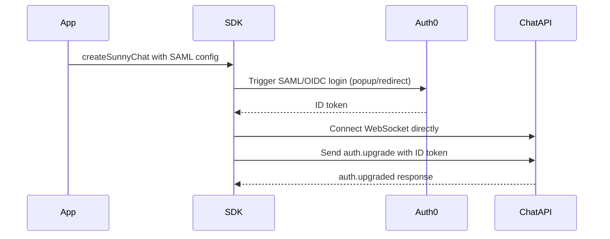
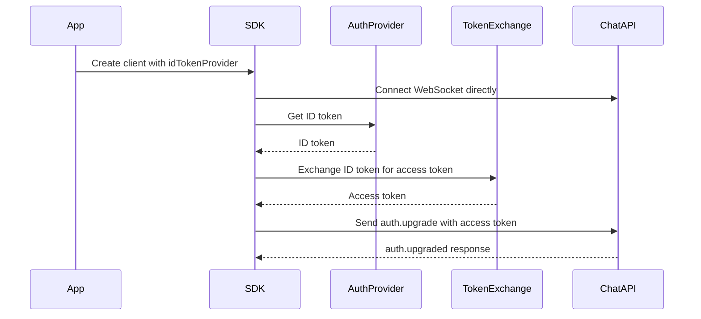

The Sunny Agents SDK supports multiple authentication modes: SAML/OIDC via Auth0, custom token exchange, passwordless authentication, and anonymous mode for local-only conversations.

## Authentication modes

### SAML/OIDC Authentication (Recommended)

For enterprise applications using SAML or OIDC authentication via Auth0:

```typescript
import { createSunnyChat } from "@sunnyhealthai/agents-sdk";

const chat = await createSunnyChat({
  container: document.getElementById("chat"),
  auth: {
    type: "saml",
    domain: "your-tenant.auth0.com",
    clientId: "your-client-id",
    connection: "guardian-saml", // Auto-login enabled
    audience: "https://api.sunnyhealthai-staging.com",
  },
});
```

**Features:**

- Automatic authentication via popup or redirect
- No manual token management
- Server-persisted conversations
- Enterprise SSO support
- Modal overlay option for native feel

### Custom Token Exchange

For applications with custom authentication providers:

```typescript
import { createSunnyChat } from "@sunnyhealthai/agents-sdk";

const chat = await createSunnyChat({
  container: document.getElementById("chat"),
  auth: {
    type: "tokenExchange",
    idTokenProvider: async () => {
      // Return ID token from your auth provider
      return localStorage.getItem("id_token");
    },
    partnerName: "your-partner-name",
    audience: "https://api.sunnyhealthai-staging.com",
    clientId: "your-client-id",
  },
});
```

**Or use the headless client directly:**

```typescript
const client = new SunnyAgentsClient({
  idTokenProvider: async () => {
    // Return ID token from your auth provider
    return localStorage.getItem("id_token");
  },
  tokenExchange: {
    partnerName: "your-partner-name",
    audience: "https://api.sunnyhealthai-staging.com",
    clientId: "your-client-id",
  },
});
```

**Features:**

- Server-persisted conversations
- Access token authentication
- Automatic token refresh
- User-specific data

### Anonymous mode

For local-only conversations without authentication:

```typescript
const client = new SunnyAgentsClient({
  websocketUrl: "wss://chat.api.sunnyhealthai-staging.com",
  createServerConversations: false,
});
```

**Features:**

- No authentication required
- Local-only conversations
- Faster setup
- No user data persistence

## Authentication flows

### SAML/OIDC Flow

For SAML/OIDC authentication via Auth0:


```mermaid
sequenceDiagram
    participant App
    participant SDK
    participant Auth0
    participant ChatAPI

    App->>SDK: createSunnyChat with SAML config
    SDK->>Auth0: Trigger SAML/OIDC login (popup/redirect)
    Auth0-->>SDK: ID token
    SDK->>ChatAPI: Connect WebSocket directly
    SDK->>ChatAPI: Send auth.upgrade with ID token
    ChatAPI-->>SDK: auth.upgraded response
```

### Token Exchange Flow

For custom token exchange:


```mermaid
sequenceDiagram
    participant App
    participant SDK
    participant AuthProvider
    participant TokenExchange
    participant ChatAPI

    App->>SDK: Create client with idTokenProvider
    SDK->>ChatAPI: Connect WebSocket directly
    SDK->>AuthProvider: Get ID token
    AuthProvider-->>SDK: ID token
    SDK->>TokenExchange: Exchange ID token for access token
    TokenExchange-->>SDK: Access token
    SDK->>ChatAPI: Send auth.upgrade with access token
    ChatAPI-->>SDK: auth.upgraded response
```

### Step-by-step

**SAML/OIDC:**
1. **Configure Auth0**: Set up SAML/OIDC connection in Auth0
2. **Create chat**: Call `createSunnyChat` with SAML/OIDC config
3. **Auto-login**: SDK automatically triggers authentication
4. **Connect**: SDK connects directly to WebSocket URL
5. **Upgrade auth**: SDK sends `auth.upgrade` message with ID token
6. **Authenticated**: SDK receives `auth.upgraded` response

**Token Exchange:**
1. **Connect**: SDK connects directly to WebSocket URL
2. **Provide ID token**: Your app provides an ID token via `idTokenProvider`
3. **Exchange token**: SDK exchanges ID token for access token
4. **Upgrade auth**: SDK sends `auth.upgrade` message with access token
5. **Authenticated**: SDK receives `auth.upgraded` response
6. **Refresh**: SDK automatically refreshes token when expired

## Authentication providers

### Auth0 SAML/OIDC (Recommended)

For enterprise SSO, use the unified API with SAML/OIDC:

```typescript
import { createSunnyChat } from "@sunnyhealthai/agents-sdk";

const chat = await createSunnyChat({
  container: document.getElementById("chat"),
  auth: {
    type: "saml",
    domain: "your-tenant.auth0.com",
    clientId: "your-client-id",
    connection: "guardian-saml", // SAML connection name
    audience: "https://api.sunnyhealthai-staging.com",
    usePopup: true, // Use popup instead of redirect
    useModal: true, // Use modal overlay for native feel
  },
});
```

### Auth0 with React

For React applications using Auth0 React SDK:

```typescript
import { useAuth0 } from "@auth0/auth0-react";
import { createSunnyChat } from "@sunnyhealthai/agents-sdk";

function MyComponent() {
  const { getIdTokenClaims } = useAuth0();

  useEffect(() => {
    createSunnyChat({
      container: document.getElementById("chat"),
      auth: {
        type: "tokenExchange",
        idTokenProvider: async () => {
          const claims = await getIdTokenClaims();
          return claims?.__raw || null;
        },
        partnerName: "your-partner-name",
        audience: "https://api.sunnyhealthai-staging.com",
        clientId: "your-auth0-client-id",
      },
    });
  }, [getIdTokenClaims]);
}
```

### Firebase

```typescript
import { getAuth } from "firebase/auth";
import { createSunnyChat } from "@sunnyhealthai/agents-sdk";

const auth = getAuth();

const chat = await createSunnyChat({
  container: document.getElementById("chat"),
  auth: {
    type: "tokenExchange",
    idTokenProvider: async () => {
      const user = auth.currentUser;
      if (!user) return null;
      return await user.getIdToken();
    },
    partnerName: "your-partner-name",
    audience: "https://api.sunnyhealthai-staging.com",
    clientId: "your-client-id",
  },
});
```

### Custom provider

```typescript
import { createSunnyChat } from "@sunnyhealthai/agents-sdk";

const chat = await createSunnyChat({
  container: document.getElementById("chat"),
  auth: {
    type: "tokenExchange",
    idTokenProvider: async () => {
      // Your custom logic to get ID token
      const response = await fetch("/api/get-id-token");
      const data = await response.json();
      return data.idToken;
    },
    partnerName: "your-partner-name",
    audience: "https://api.sunnyhealthai-staging.com",
    clientId: "your-client-id",
  },
});
```

## Configuration options

### SAML/OIDC Configuration

```typescript
interface SamlOidcAuthConfig {
  type: "saml" | "oidc";
  domain: string; // Auth0 domain (e.g., "your-tenant.auth0.com")
  clientId: string; // Auth0 client ID
  connection: string; // SAML/OIDC connection name (triggers auto-login)
  organization?: string; // Optional organization ID
  audience?: string; // API audience for access tokens
  redirectUri?: string; // Callback URL (defaults to current origin + /callback.html)
  usePopup?: boolean; // Use popup instead of redirect (default: true)
  useModal?: boolean; // Use modal overlay instead of popup (default: true)
  storageType?: "sessionStorage" | "localStorage"; // Token storage (default: "sessionStorage")
}
```

### Token Exchange Configuration

```typescript
interface TokenExchangeAuthConfig {
  type: "tokenExchange";
  idTokenProvider: () => Promise<string | null>;
  partnerName: string; // Partner identifier (e.g., "sunny-health-external-mock")
  audience: string; // API audience (e.g., "https://api.sunnyhealthai-staging.com")
  clientId: string; // Auth0 client ID
  tokenExchangeUrl?: string; // Optional, defaults to "https://auth.sunnyhealth.live/oauth/token"
  devRoute?: string; // Optional developer route
}
```

### Partner name

The partner name is used to construct the subject token type:

```
urn:{partnerName}:id-token
```

Example: `urn:sunny-health-external-mock:id-token`

### Audience

The audience specifies which API the access token is for:

```
https://api.sunnyhealthai-staging.com
```

### Client ID

Your Auth0 client ID for token exchange.

## Automatic token refresh

The SDK automatically refreshes tokens when they expire:

```typescript
// Token is refreshed automatically
// No action needed from your app
```

Token refresh happens:

- Before token expiration
- On authentication errors
- When establishing new connections

## Session management

### Session storage

Auth0 tokens use `sessionStorage` by default (configurable via `storageType` in `SamlOidcAuthConfig`). The `SunnyAgentsClient` uses `sessionStorageKey` for session IDs when provided:

```typescript
const client = new SunnyAgentsClient({
  sessionStorageKey: "my_app_session", // Custom key for session IDs
  // ... other config
});
```

### Session lifecycle

1. **Create**: Session created on first connection
2. **Store**: Session/token storage per auth type (sessionStorage for Auth0 by default)
3. **Reuse**: Session reused on reconnection
4. **Expire**: Session expires after timeout
5. **Refresh**: New session created when expired

## Passwordless Authentication

For email or SMS-based passwordless authentication without passwords:

```typescript
import { PasswordlessAuthManager, SunnyAgentsClient, LLMWebSocketManager } from "@sunnyhealthai/agents-sdk";

// Create WebSocket manager
const wsManager = new LLMWebSocketManager({
  websocketUrl: "wss://chat.api.sunnyhealthai-staging.com",
});

// Create passwordless auth manager
const authManager = new PasswordlessAuthManager({
  wsManager,
  migrateHistory: true, // Migrate anonymous chat history after auth
  tokenExchange: {
    partnerName: "your-partner-name",
    audience: "https://api.sunnyhealthai-staging.com",
    clientId: "your-client-id",
  },
});

// Listen for OTP sent event
authManager.onOtpSent((connection) => {
  console.log(`OTP sent via ${connection}`);
});

// Listen for auth state changes
authManager.onAuthStateChange((isAuthenticated) => {
  console.log(`Authenticated: ${isAuthenticated}`);
});

// Start passwordless flow (email or SMS)
await authManager.startLogin({ email: "user@example.com" });
// or
await authManager.startLogin({ phoneNumber: "+1234567890" });

// Verify OTP code
await authManager.verifyCode({
  email: "user@example.com",
  code: "123456",
});

// Create client with shared WebSocket manager
const client = new SunnyAgentsClient({
  wsManager, // Share WebSocket connection
  tokenExchange: {
    partnerName: "your-partner-name",
    audience: "https://api.sunnyhealthai-staging.com",
    clientId: "your-client-id",
  },
});
```

**Features:**

- Email or SMS authentication
- No passwords required
- WebSocket-based (no page refreshes)
- Optional chat history migration
- Automatic token management
- Real-time OTP delivery

**Configuration:**

```typescript
interface PasswordlessAuthConfig {
  wsManager: LLMWebSocketManager; // Required - WebSocket manager instance
  migrateHistory?: boolean; // Migrate anonymous chat history (default: false)
  tokenExchange?: TokenExchangeConfig; // Optional token exchange config
  storageKey?: string; // Storage key for auth state
  storageType?: "memory" | "sessionStorage" | "localStorage"; // Storage type (default: "memory")
}
```

## Anonymous mode

For applications that don't require authentication:

```typescript
const client = new SunnyAgentsClient({
  websocketUrl: "wss://chat.api.sunnyhealthai-staging.com",
  createServerConversations: false, // Explicitly disable server persistence
});
```

Or use the `anonymous` option with the widget:

```typescript
attachSunnyChat({
  container: document.getElementById("chat"),
  config: {
    websocketUrl: "wss://chat.api.sunnyhealthai-staging.com",
  },
  anonymous: true, // Enable anonymous mode
});
```

## Error handling

### Authentication errors

```typescript
try {
  await client.sendMessage("Hello!");
} catch (error) {
  if (error.message.includes("token") || error.message.includes("auth")) {
    // Handle authentication error
    console.error("Authentication failed:", error);
    // Redirect to login or show error message
  }
}
```

### Token refresh errors

```typescript
// SDK handles token refresh automatically
// If refresh fails, you'll get an authentication error
```

## Best practices

1. **Secure storage**: Store ID tokens securely (not in localStorage for sensitive apps)
2. **Error handling**: Always handle authentication errors
3. **Token refresh**: Let SDK handle token refresh automatically
4. **Session management**: Use custom session keys for multi-tenant apps
5. **Anonymous mode**: Use anonymous mode for public-facing features

## Examples

### SAML/OIDC Authentication

```typescript
import { createSunnyChat } from "@sunnyhealthai/agents-sdk";

const chat = await createSunnyChat({
  container: document.getElementById("chat"),
  auth: {
    type: "saml",
    domain: "my-tenant.auth0.com",
    clientId: "abc123",
    connection: "guardian-saml",
    audience: "https://api.sunnyhealthai-staging.com",
  },
});
```

### Custom Token Exchange

```typescript
import { createSunnyChat } from "@sunnyhealthai/agents-sdk";

const chat = await createSunnyChat({
  container: document.getElementById("chat"),
  auth: {
    type: "tokenExchange",
    idTokenProvider: async () => localStorage.getItem("id_token"),
    partnerName: "my-app",
    audience: "https://api.sunnyhealthai-staging.com",
    clientId: "abc123",
  },
});
```

### Passwordless Authentication

```typescript
import { PasswordlessAuthManager, SunnyAgentsClient, LLMWebSocketManager } from "@sunnyhealthai/agents-sdk";

const wsManager = new LLMWebSocketManager({
  websocketUrl: "wss://chat.api.sunnyhealthai-staging.com",
});

const authManager = new PasswordlessAuthManager({
  wsManager,
  migrateHistory: true,
  tokenExchange: {
    partnerName: "my-app",
    audience: "https://api.sunnyhealthai-staging.com",
    clientId: "abc123",
  },
});

// Start authentication
await authManager.startLogin({ email: "user@example.com" });

// Verify OTP
await authManager.verifyCode({
  email: "user@example.com",
  code: "123456",
});

// Create client
const client = new SunnyAgentsClient({
  wsManager,
  tokenExchange: {
    partnerName: "my-app",
    audience: "https://api.sunnyhealthai-staging.com",
    clientId: "abc123",
  },
});
```

### Anonymous client

```typescript
const client = new SunnyAgentsClient({
  websocketUrl: "wss://chat.api.sunnyhealthai-staging.com",
  createServerConversations: false,
});
```

## Next steps

- **[Authentication Tutorial](/authentication-tutorial)** - Step-by-step authentication setup
- **[Conversations](/conversations)** - Learn about conversation management
- **[Overview](/overview)** - Understand SDK architecture
