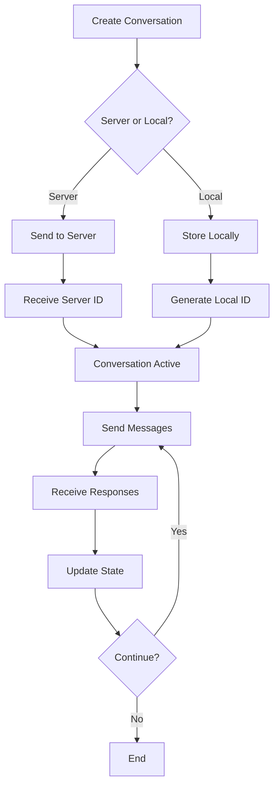

Conversations are the container for chat interactions. Learn how to create, manage, and persist conversations with the Sunny Agents SDK.

## Creating conversations

### Automatic creation

Conversations are created automatically when you send a message:

```typescript
// Conversation is created automatically
await client.sendMessage("Hello!");
```

### Explicit creation

Create a conversation explicitly:

```typescript
const conversationId = await client.createConversation("My Conversation");
client.setActiveConversation(conversationId);
```

### With title

Set a title when creating:

```typescript
const conversationId = await client.createConversation("Customer Support Chat");
```

## Managing multiple conversations

The SDK supports multiple concurrent conversations:

```typescript
// Create first conversation
const conv1 = await client.createConversation("Support");
await client.sendMessage("Hello", { conversationId: conv1 });

// Create second conversation
const conv2 = await client.createConversation("Sales");
await client.sendMessage("Hi", { conversationId: conv2 });

// Switch between conversations
client.setActiveConversation(conv1);
```

### Getting all conversations

```typescript
const snapshot = client.getSnapshot();
console.log("All conversations:", snapshot.conversations);
```

### Active conversation

```typescript
const snapshot = client.getSnapshot();
const activeId = snapshot.activeConversationId;

if (activeId) {
  const activeConversation = snapshot.conversations.find(
    (c) => c.id === activeId
  );
  console.log("Active conversation:", activeConversation);
}
```

## Conversation state

Each conversation has:

```typescript
interface ConversationState {
  id: string; // Unique conversation ID
  title?: string | null; // Optional title
  messages: SunnyAgentMessage[]; // Array of messages
  quickResponses?: string[]; // Suggested quick responses
}
```

### Accessing conversation data

```typescript
const snapshot = client.getSnapshot();
const conversation = snapshot.conversations.find(
  (c) => c.id === "conversation-id"
);

if (conversation) {
  console.log("Title:", conversation.title);
  console.log("Messages:", conversation.messages);
  console.log("Quick responses:", conversation.quickResponses);
}
```

## Server vs local conversations

### Server-persisted conversations

When authenticated, conversations are persisted on the server:

```typescript
const client = new SunnyAgentsClient({
  idTokenProvider: async () => localStorage.getItem("id_token"),
  tokenExchange: {
    partnerName: "your-partner-name",
    audience: "https://api.sunnyhealthai-staging.com",
    clientId: "your-client-id",
  },
  createServerConversations: true, // Default when authenticated
});

// Conversation is created on server
const conversationId = await client.createConversation("My Chat");
```

**Benefits:**
- Persisted across sessions
- Accessible from multiple devices
- Server-generated IDs
- Full conversation history

### Local-only conversations

For anonymous mode, conversations are stored locally:

```typescript
const client = new SunnyAgentsClient({
  websocketUrl: "wss://chat.api.sunnyhealthai-staging.com",
  authorizeUrl: "https://chat.api.sunnyhealthai-staging.com/authorize",
  createServerConversations: false, // Local-only
});

// Conversation exists only in client memory
const conversationId = await client.createConversation("Local Chat");
```

**Characteristics:**
- Lost on page refresh (unless you persist them)
- Client-generated IDs
- No server persistence
- Faster (no server round-trip)

## Conversation persistence

### Server persistence

Server-persisted conversations are automatically saved:

```typesation
// Conversation is automatically saved on server
await client.createConversation("Persisted Chat");
```

### Local persistence

For local conversations, persist them yourself:

```typescript
// Save conversation ID to localStorage
const conversationId = await client.createConversation("Local Chat");
localStorage.setItem("conversation_id", conversationId);

// Restore on page load
const savedId = localStorage.getItem("conversation_id");
if (savedId) {
  client.setActiveConversation(savedId);
}
```

### Vanilla widget persistence

The vanilla widget automatically persists conversation IDs:

```typescript
attachSunnyChat({
  container: document.getElementById("chat"),
  config: {
    // ... config
  },
  conversationStorageKey: "my_app_conversation_id", // Custom key
});
```

## Conversation events

### Conversation created

```typescript
client.on("conversationCreated", ({ conversationId, title }) => {
  console.log("New conversation:", conversationId, title);
  // Update UI with new conversation
});
```

### Messages updated

```typescript
client.on("messagesUpdated", ({ conversationId, messages }) => {
  console.log("Messages updated:", conversationId, messages);
  // Update UI with new messages
});
```

## Conversation lifecycle



## Best practices

1. **Set active conversation**: Always set the active conversation before sending messages
2. **Handle IDs**: Server may return different IDs than local IDs
3. **Persist locally**: For local conversations, persist IDs yourself
4. **Clean up**: Remove old conversations to free memory
5. **Title management**: Set meaningful titles for better UX

## Examples

### Create and use conversation

```typescript
// Create conversation
const conversationId = await client.createConversation("Support Chat");

// Set as active
client.setActiveConversation(conversationId);

// Send message
await client.sendMessage("I need help", { conversationId });
```

### Switch between conversations

```typescript
// Get all conversations
const snapshot = client.getSnapshot();

// Switch to first conversation
if (snapshot.conversations.length > 0) {
  client.setActiveConversation(snapshot.conversations[0].id);
}
```

### List conversations

```typescript
const snapshot = client.getSnapshot();

snapshot.conversations.forEach((conv) => {
  console.log(`${conv.title || "Untitled"}: ${conv.messages.length} messages`);
});
```

## Next steps

- **[Messaging](/messaging)** - Learn about sending messages
- **[Authentication](/authentication)** - Set up authenticated sessions
- **[Custom UI Tutorial](/custom-ui)** - Build conversation management UI
