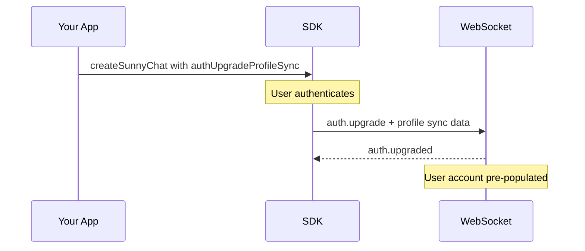

When a user authenticates, the SDK can send partner-collected data -- profile details, address, insurance, and dependents -- alongside the `auth.upgrade` message. Sunny uses this to pre-populate the user's account, removing the need for the user to re-enter information they've already provided to your application.

## How it works

Profile sync data is included in the `auth.upgrade` WebSocket message that fires when a user authenticates. The backend uses **upsert semantics**: it only creates or updates records for the fields you provide, and leaves everything else untouched.



## Configuration

Pass `authUpgradeProfileSync` to `createSunnyChat`. You can provide static data or an async function that resolves the data at authentication time.

### Static data

```typescript
import { createSunnyChat } from "@sunnyhealthai/agents-sdk";

const chat = createSunnyChat({
  container: document.getElementById("chat"),
  partnerIdentifier: "acme-health",
  publicKey: "pk-sunnyagents_abc_xyz",
  authType: "tokenExchange",
  idTokenProvider: async () => getMyToken(),
  authUpgradeProfileSync: {
    user_profile: {
      first_name: "Jane",
      last_name: "Doe",
      phone: "+15551234567",
      date_of_birth: "1990-03-15",
      gender: "female",
    },
    user_address: {
      address_line_1: "123 Main St",
      city: "San Francisco",
      state: "CA",
      zip_code: "94102",
    },
  },
});
```

### Async provider

Use a function when the data needs to be fetched at authentication time -- for example, from your own API:

```typescript
const chat = createSunnyChat({
  container: document.getElementById("chat"),
  partnerIdentifier: "acme-health",
  publicKey: "pk-sunnyagents_abc_xyz",
  authType: "tokenExchange",
  idTokenProvider: async () => getMyToken(),
  authUpgradeProfileSync: async () => {
    const res = await fetch("/api/user/profile", { credentials: "include" });
    if (!res.ok) return null;
    const user = await res.json();
    return {
      user_profile: {
        first_name: user.firstName,
        last_name: user.lastName,
        phone: user.phone,
        date_of_birth: user.dob,
      },
      user_address: user.address
        ? {
            address_line_1: user.address.line1,
            city: user.address.city,
            state: user.address.state,
            zip_code: user.address.zip,
          }
        : undefined,
      insurances: user.insurance
        ? [
            {
              partner_plan_id: user.insurance.planId,
              member_id: user.insurance.memberId,
              group_id: user.insurance.groupId,
            },
          ]
        : undefined,
    };
  },
});
```

Returning `null` from the provider skips profile sync entirely -- the user authenticates normally without any pre-populated data.

## Data types

All fields in `authUpgradeProfileSync` are optional. Include only what your application has collected.

### User profile

Basic demographic information. All fields are optional; only provided fields are updated.

```typescript
interface AuthUpgradeProfile {
  first_name?: string | null;
  last_name?: string | null;
  phone?: string | null;
  date_of_birth?: string | null; // "YYYY-MM-DD"
  gender?: string | null;        // "male", "female", "other"
}
```

### Address

Mailing address for the user. When provided, `address_line_1`, `city`, `state`, and `zip_code` are required.

```typescript
interface AuthUpgradeAddress {
  address_line_1: string;
  address_line_2?: string | null;
  city: string;
  state: string;
  zip_code: string;
  country?: string; // defaults to "USA"
}
```

### Insurance

Insurance plan records. The `partner_plan_id` is a UUID that maps to a plan configured in Sunny Central for your partner. Requires `partnerIdentifier` on the SDK connection.

```typescript
interface AuthUpgradeInsurance {
  partner_plan_id: string; // UUID from Sunny Central
  member_id: string;
  group_id: string;
}
```

### Dependents

Family members or dependents covered under the user's insurance. Each dependent can be linked to a specific insurance plan by index.

```typescript
interface AuthUpgradeDependent {
  first_name: string;
  last_name: string;
  date_of_birth: string;         // "YYYY-MM-DD"
  gender?: string | null;
  relationship_code: string;     // Stedi code (see table below)
  member_id?: string | null;     // if different from subscriber
  insurance_index?: number | null; // index into the insurances array
}
```

<Accordion title="Relationship codes">

The `relationship_code` field uses [Stedi relationship codes](https://www.stedi.com/edi/x12/element/1069):

| Code | Relationship |
| ---- | ------------ |
| `18` | Self |
| `01` | Spouse |
| `19` | Child |
| `20` | Employee |
| `21` | Unknown |
| `39` | Organ donor |
| `40` | Cadaver donor |
| `53` | Life partner |
| `G8` | Other relationship |

</Accordion>

#### Linking dependents to insurance plans

The `insurance_index` field links a dependent to a specific entry in the `insurances` array (zero-based). If omitted, the dependent is associated with the first insurance plan.

```typescript
authUpgradeProfileSync: {
  insurances: [
    { partner_plan_id: "plan-a-uuid", member_id: "M001", group_id: "G100" },
    { partner_plan_id: "plan-b-uuid", member_id: "M002", group_id: "G200" },
  ],
  dependents: [
    {
      first_name: "Alex",
      last_name: "Doe",
      date_of_birth: "2015-06-01",
      relationship_code: "19", // child
      insurance_index: 0,      // covered under plan-a
    },
    {
      first_name: "Sam",
      last_name: "Doe",
      date_of_birth: "1991-11-20",
      relationship_code: "01", // spouse
      // insurance_index omitted -- defaults to first plan (plan-a)
    },
  ],
}
```

## Full example

A complete example syncing all data types with an async provider:

```typescript
import { createSunnyChat } from "@sunnyhealthai/agents-sdk";

const chat = createSunnyChat({
  container: document.getElementById("chat"),
  partnerIdentifier: "acme-health",
  publicKey: "pk-sunnyagents_abc_xyz",
  authType: "tokenExchange",
  idTokenProvider: async () => getMyToken(),
  authUpgradeProfileSync: async () => {
    const user = await fetchCurrentUser();
    return {
      user_profile: {
        first_name: user.firstName,
        last_name: user.lastName,
        phone: user.phone,
        date_of_birth: user.dob,
        gender: user.gender,
      },
      user_address: {
        address_line_1: user.address.street,
        city: user.address.city,
        state: user.address.state,
        zip_code: user.address.zip,
      },
      insurances: user.plans.map((plan) => ({
        partner_plan_id: plan.sunnyPlanId,
        member_id: plan.memberId,
        group_id: plan.groupId,
      })),
      dependents: user.dependents.map((dep, i) => ({
        first_name: dep.firstName,
        last_name: dep.lastName,
        date_of_birth: dep.dob,
        gender: dep.gender,
        relationship_code: dep.relationshipCode,
        member_id: dep.memberId,
        insurance_index: dep.planIndex,
      })),
    };
  },
});
```

## Behavior notes

- **Upsert semantics** -- the backend creates new records or updates existing ones. Existing data not covered by the payload is left unchanged.
- **Dependent deduplication** -- dependents are matched by natural key (first name + last name + date of birth). Sending the same dependent twice updates the existing record rather than creating a duplicate.
- **Auth mode compatibility** -- profile sync works with all authentication modes (token exchange and passwordless).
- **Timing** -- the async provider is called at authentication time, just before the `auth.upgrade` message is sent. This ensures data is as fresh as possible.

## Next steps

- **[Authentication](/ask-sunny/authentication)** -- Configure authentication modes
- **[Key Concepts](/ask-sunny/concepts)** -- Conversations, events, and state management
- **[API Reference](/ask-sunny/api-reference/api-reference/authentication/token-exchange)** -- REST and WebSocket API schemas
