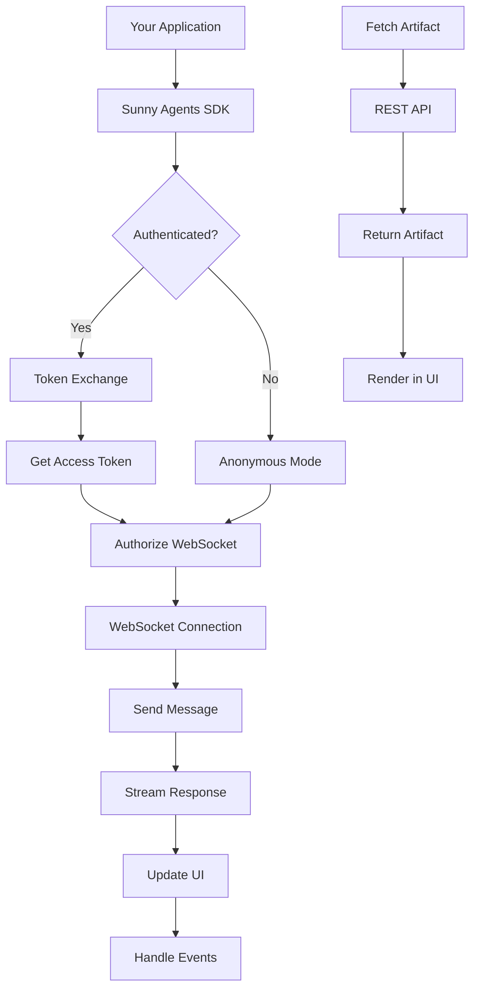

The Sunny Agents SDK is a TypeScript/JavaScript library that enables you to embed AI-powered chat experiences into any web application. It provides both a headless client for custom UI implementations and a ready-to-use vanilla JavaScript widget for quick integration.

## What you can build

The SDK is designed specifically for healthcare applications:

<CardGroup cols={2}>
  <Card title="Provider search & booking" icon="duotone stethoscope">
    Help patients find in-network providers by specialty, location, and availability. Book appointments in seconds with AI-powered guidance.
  </Card>
  <Card title="Health information assistant" icon="duotone heart-pulse">
    Provide reliable health information and support 24/7. Answer questions about symptoms, medications, and care options.
  </Card>
  <Card title="Benefits navigation" icon="duotone shield-heart">
    Guide employees and members through their healthcare benefits. Help them understand coverage and find cost-effective care options.
  </Card>
  <Card title="Care coordination" icon="duotone user-doctor">
    Streamline care coordination by connecting patients with the right providers at the right time, reducing ER visits and improving outcomes.
  </Card>
</CardGroup>

## Core capabilities

The SDK is organized around four main capabilities:

<CardGroup cols={2}>
  <Card title="Messaging" icon="duotone message" href="/messaging">
    Send messages and receive streaming responses in real-time. Support file attachments, markdown rendering, and rich content formatting. Handle message events and streaming updates with ease.
  </Card>
  <Card title="Conversations" icon="duotone comments" href="/conversations">
    Manage multiple conversations with state persistence. Create, switch between, and manage conversation history. Support both server-persisted and local-only conversations.
  </Card>
  <Card title="Authentication" icon="duotone lock" href="/authentication">
    Secure token exchange flow for authenticated sessions. Support for ID token providers (Auth0, Firebase, etc.) with automatic token refresh. Anonymous mode for local-only conversations.
  </Card>
  <Card title="Artifacts" icon="duotone box" href="/artifacts">
    Fetch and render rich content objects like doctor profiles, structured data, and custom artifacts. Automatic caching for performance. Type-safe artifact handling.
  </Card>
</CardGroup>

## How it works

The SDK connects to Sunny Agents services via WebSocket for real-time messaging. When you send a message, the SDK establishes a WebSocket connection (if not already connected), sends your message, and streams the response back in real-time. For authenticated sessions, the SDK handles token exchange automatically.

<Accordion title="Architecture diagram">

</Accordion>

## Two integration approaches

### Headless Client

Build a completely custom UI with full control:

```typescript
import { SunnyAgentsClient } from "@sunnyhealthai/agents-sdk";

const client = new SunnyAgentsClient({
  websocketUrl: "wss://chat.api.sunnyhealthai-staging.com",
  authorizeUrl: "https://chat.api.sunnyhealthai-staging.com/authorize",
});

// Listen to events
client.on("snapshot", (snapshot) => {
  // Update your UI
});

// Send messages
await client.sendMessage("I need to find a primary care doctor");
```

### Vanilla Widget

Drop-in chat widget for quick integration:

```typescript
import { attachSunnyChat } from "@sunnyhealthai/agents-sdk";

attachSunnyChat({
  container: document.getElementById("chat"),
  config: {
    websocketUrl: "wss://chat.api.sunnyhealthai-staging.com",
    authorizeUrl: "https://chat.api.sunnyhealthai-staging.com/authorize",
  },
});
```

## Framework compatibility

The SDK is framework-agnostic and works with:

- **React** - Use the headless client with hooks
- **Vue** - Integrate with Vue's reactivity system
- **Angular** - Use with Angular services and components
- **Vanilla JavaScript** - Use directly or with the widget
- **Any framework** - The headless client works everywhere

## Authentication modes

### Authenticated Mode

For production applications requiring user authentication:

```typescript
const client = new SunnyAgentsClient({
  idTokenProvider: async () => {
    // Return ID token from your auth provider
    return localStorage.getItem("id_token");
  },
  tokenExchange: {
    partnerName: "your-partner-name",
    audience: "https://api.sunnyhealthai-staging.com",
    clientId: "your-client-id",
  },
});
```

### Anonymous Mode

For local-only conversations without server persistence:

```typescript
const client = new SunnyAgentsClient({
  websocketUrl: "wss://chat.api.sunnyhealthai-staging.com",
  authorizeUrl: "https://chat.api.sunnyhealthai-staging.com/authorize",
  createServerConversations: false,
});
```

## Key features

- **Real-time streaming** - Messages stream in real-time as they're generated
- **Type-safe** - Full TypeScript support with comprehensive type definitions
- **Event-driven** - Subscribe to events for snapshot updates, streaming deltas, and more
- **Artifact support** - Fetch and render rich content objects
- **MCP approvals** - Handle tool execution approvals interactively
- **File attachments** - Send files as base64-encoded attachments
- **Automatic reconnection** - WebSocket connections automatically reconnect on failure
- **Token management** - Automatic token refresh and caching

## Installation

```bash
npm install @sunnyhealthai/agents-sdk
# or
pnpm add @sunnyhealthai/agents-sdk
# or
yarn add @sunnyhealthai/agents-sdk
```

## Getting help

<CardGroup cols={2}>
  <Card title="Quickstart guide" icon="duotone rocket" href="/quickstart">
    Get up and running in minutes
  </Card>
  <Card title="API reference" icon="duotone code" href="/api-reference">
    Complete SDK documentation
  </Card>
  <Card title="Tutorials" icon="duotone book-sparkles" href="/widget-setup">
    Step-by-step integration guides
  </Card>
  <Card title="Concepts" icon="duotone lightbulb" href="/concepts">
    Learn core concepts and patterns
  </Card>
</CardGroup>

---

<Markdown src="/snippets/note.mdx" />
