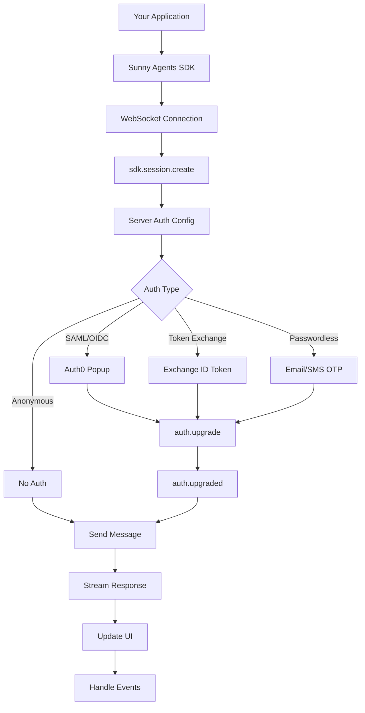

The Sunny Agents SDK is a TypeScript/JavaScript library that enables you to embed AI-powered chat experiences into any web application. It provides both a headless client for custom UI implementations and a ready-to-use vanilla JavaScript widget for quick integration.

## What you can build

The SDK is designed specifically for healthcare applications:

<CardGroup cols={2}>
  <Card title="Provider search & booking" icon="duotone stethoscope">
    Help patients find in-network providers by specialty, location, and availability. Book appointments in seconds with AI-powered guidance.
  </Card>
  <Card title="Health information assistant" icon="duotone heart-pulse">
    Provide reliable health information and support 24/7. Answer questions about symptoms, medications, and care options.
  </Card>
  <Card title="Benefits navigation" icon="duotone shield-heart">
    Guide employees and members through their healthcare benefits. Help them understand coverage and find cost-effective care options.
  </Card>
  <Card title="Care coordination" icon="duotone user-doctor">
    Streamline care coordination by connecting patients with the right providers at the right time, reducing ER visits and improving outcomes.
  </Card>
</CardGroup>

## Core capabilities

The SDK is organized around four main capabilities:

<CardGroup cols={2}>
  <Card title="Messaging" icon="duotone message" href="/messaging">
    Send messages and receive streaming responses in real-time. Support file attachments, markdown rendering, and rich content formatting. Handle message events and streaming updates with ease.
  </Card>
  <Card title="Conversations" icon="duotone comments" href="/conversations">
    Manage multiple conversations with state persistence. Create, switch between, and manage conversation history. Support both server-persisted and local-only conversations.
  </Card>
  <Card title="Authentication" icon="duotone lock" href="/authentication">
    Multiple authentication methods: SAML/OIDC via Auth0, custom token exchange, passwordless email/SMS, and anonymous mode. Automatic token management and refresh.
  </Card>
  <Card title="Artifacts" icon="duotone box" href="/artifacts">
    Rich content delivered inline in messages via WebSocket. Parse embedded JSON for doctor profiles and structured data.
  </Card>
</CardGroup>

## Partner setup

`publicKey` and `partnerIdentifier` are obtained from **Sunny Central**, the partner portal. Sign in at [platform.sunnyhealthai.com](https://platform.sunnyhealthai.com) (production) or [platform.sunnyhealthai-staging.com](https://platform.sunnyhealthai-staging.com) (staging), then go to **Developer Tools** to create API keys, view your partner name, and configure authentication (allowed domains, token exchange, or SAML/OIDC). See [Partner Setup](/partner-setup) for details.

## How it works

The SDK connects to Sunny Agents services via WebSocket for real-time messaging. When you send a message, the SDK establishes a WebSocket connection (if not already connected), sends your message, and streams the response back in real-time. For authenticated sessions, the SDK handles token exchange automatically.

<Accordion title="Architecture diagram">

```mermaid
graph TD
    A[Your Application] --> B[Sunny Agents SDK]
    B --> C[WebSocket Connection]
    C --> D[sdk.session.create]
    D --> E[Server Auth Config]
    
    E --> F{Auth Type}
    F -->|SAML/OIDC| G[Auth0 Popup]
    F -->|Token Exchange| H[Exchange ID Token]
    F -->|Passwordless| I[Email/SMS OTP]
    F -->|Anonymous| J[No Auth]
    
    G --> K[auth.upgrade]
    H --> K
    I --> K
    J --> L[Send Message]
    K --> M[auth.upgraded]
    M --> L
    
    L --> N[Stream Response]
    N --> O[Update UI]
    O --> P[Handle Events]
```
</Accordion>

## Three integration approaches

### Unified API (Recommended)

Simplest way to get started. Provide your partner identifier, public key, and auth type -- all authentication configuration is handled automatically by the server:

```typescript
import { createSunnyChat } from "@sunnyhealthai/agents-sdk";

const chat = await createSunnyChat({
  container: document.getElementById("chat"),
  partnerIdentifier: "acme-health",
  publicKey: "pk-sunnyagents_abc_xyz",
  authType: "saml", // or "passwordless", "oidc", "tokenExchange"
});

// Access the client for programmatic control
chat.client.on("snapshot", (snapshot) => { /* ... */ });
// Clean up when done
chat.destroy();
```

### Headless Client

Build a completely custom UI with full control:

```typescript
import { SunnyAgentsClient } from "@sunnyhealthai/agents-sdk";

// websocketUrl defaults to wss://chat.api.sunnyhealthai-staging.com
const client = new SunnyAgentsClient();

// Listen to events
client.on("snapshot", (snapshot) => {
  // Update your UI
});

// Send messages
await client.sendMessage("I need to find a primary care doctor");
```

### Vanilla Widget

Drop-in chat widget for quick integration with manual configuration:

```typescript
import { attachSunnyChat } from "@sunnyhealthai/agents-sdk";

const { client, destroy } = attachSunnyChat({
  container: document.getElementById("chat"),
  config: {
    websocketUrl: "wss://chat.api.sunnyhealthai-staging.com",
  },
});
```

## Framework compatibility

The SDK is framework-agnostic and works with:

- **React** - Use the headless client with hooks
- **Vue** - Integrate with Vue's reactivity system
- **Angular** - Use with Angular services and components
- **Vanilla JavaScript** - Use directly or with the widget
- **Any framework** - The headless client works everywhere

## Authentication modes

The SDK supports four authentication methods. With `createSunnyChat`, you simply specify the `authType` and the SDK handles everything else using server-provided configuration:

### SAML/OIDC Authentication (Recommended for Enterprise)

Automatic authentication via Auth0 with SAML or OIDC. The SDK triggers a popup login automatically:

```typescript
import { createSunnyChat } from "@sunnyhealthai/agents-sdk";

const chat = await createSunnyChat({
  container: document.getElementById("chat"),
  partnerIdentifier: "acme-health",
  publicKey: "pk-sunnyagents_abc_xyz",
  authType: "saml", // or "oidc"
});
```

### Custom Token Exchange

For applications with their own authentication (Auth0, Firebase, custom providers):

```typescript
import { createSunnyChat } from "@sunnyhealthai/agents-sdk";

const chat = await createSunnyChat({
  container: document.getElementById("chat"),
  partnerIdentifier: "acme-health",
  publicKey: "pk-sunnyagents_abc_xyz",
  authType: "tokenExchange",
  idTokenProvider: async () => {
    // Return an ID token from your auth provider
    return localStorage.getItem("id_token");
  },
});
```

### Passwordless Authentication

Email or SMS-based authentication without passwords. The SDK renders a verification UI in the chat automatically:

```typescript
import { createSunnyChat } from "@sunnyhealthai/agents-sdk";

const chat = await createSunnyChat({
  container: document.getElementById("chat"),
  partnerIdentifier: "acme-health",
  publicKey: "pk-sunnyagents_abc_xyz",
  authType: "passwordless",
});
```

### Anonymous Mode

For local-only conversations without server persistence, use the headless client directly:

```typescript
import { SunnyAgentsClient } from "@sunnyhealthai/agents-sdk";

const client = new SunnyAgentsClient({
  createServerConversations: false,
});
```

## Key features

- **Real-time streaming** - Messages stream in real-time as they're generated
- **Type-safe** - Full TypeScript support with comprehensive type definitions
- **Event-driven** - Subscribe to events for snapshot updates, streaming deltas, and more
- **Artifact support** - Parse and render rich content delivered inline in messages
- **MCP approvals** - Handle tool execution approvals interactively
- **File attachments** - Send files as base64-encoded attachments
- **Automatic reconnection** - WebSocket connections automatically reconnect on failure
- **Token management** - Automatic token refresh and caching

## Installation

```bash
npm install @sunnyhealthai/agents-sdk
# or
pnpm add @sunnyhealthai/agents-sdk
# or
yarn add @sunnyhealthai/agents-sdk
```

## Getting help

<CardGroup cols={2}>
  <Card title="Quickstart guide" icon="duotone rocket" href="/quickstart">
    Get up and running in minutes
  </Card>
  <Card title="API reference" icon="duotone code" href="/api-reference">
    REST token exchange, WebSocket schemas, and message types
  </Card>
  <Card title="Tutorials" icon="duotone book-sparkles" href="/widget-setup">
    Step-by-step integration guides
  </Card>
  <Card title="Concepts" icon="duotone lightbulb" href="/concepts">
    Learn core concepts and patterns
  </Card>
</CardGroup>

---

<Markdown src="/snippets/note.mdx" />
