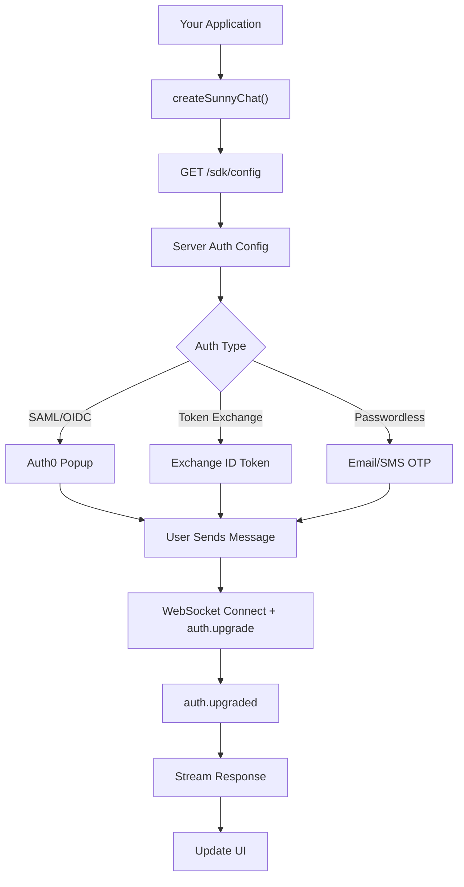

The Sunny Agents SDK is a TypeScript/JavaScript library that enables you to embed AI-powered chat experiences into any web application. Use `createSunnyChat` to drop in a fully-featured chat widget with automatic authentication and server-driven configuration.

## What you can build

The SDK is designed specifically for healthcare applications:

<CardGroup cols={2}>
  <Card title="Provider search & booking" icon="duotone stethoscope">
    Help patients find in-network providers by specialty, location, and availability. Book appointments in seconds with AI-powered guidance.
  </Card>
  <Card title="Health information assistant" icon="duotone heart-pulse">
    Provide reliable health information and support 24/7. Answer questions about symptoms, medications, and care options.
  </Card>
  <Card title="Benefits navigation" icon="duotone shield-heart">
    Guide employees and members through their healthcare benefits. Help them understand coverage and find cost-effective care options.
  </Card>
  <Card title="Care coordination" icon="duotone user-doctor">
    Streamline care coordination by connecting patients with the right providers at the right time, reducing ER visits and improving outcomes.
  </Card>
</CardGroup>

## Core capabilities

<CardGroup cols={2}>
  <Card title="Authentication" icon="duotone lock" href="/authentication">
    Multiple authentication methods: SAML/OIDC via Auth0, custom token exchange, and passwordless email/SMS. Automatic token management and refresh.
  </Card>
  <Card title="Artifacts" icon="duotone box" href="/artifacts">
    Rich content delivered inline in messages via WebSocket. Parse embedded JSON for doctor profiles and structured data.
  </Card>
  <Card title="Key Concepts" icon="duotone lightbulb" href="/concepts">
    Conversations, messages, events, MCP approvals, file attachments, and state management.
  </Card>
  <Card title="API Reference" icon="duotone code" href="/api-reference">
    REST and WebSocket API schemas and message types.
  </Card>
</CardGroup>

## Partner setup

`publicKey` and `partnerIdentifier` are obtained from **Sunny Central**, the partner portal. Sign in at [platform.sunnyhealthai.com](https://platform.sunnyhealthai.com) (production) or [platform.sunnyhealthai-staging.com](https://platform.sunnyhealthai-staging.com) (staging), then go to **Developer Tools** to create API keys, view your partner name, and configure authentication (allowed domains, token exchange, or SAML/OIDC). See [Partner Setup](/partner-setup) for details.

## How it works

`createSunnyChat` fetches your partner's auth configuration from the server via the [`/sdk/config`](/api-reference/authentication/get-sdk-config) endpoint, activates the chosen authentication mode, and renders a chat widget in your container. The WebSocket connection is established when the user sends their first message.

<Accordion title="Architecture diagram">

```mermaid
graph TD
    A[Your Application] --> B["createSunnyChat()"]
    B --> C["GET /sdk/config"]
    C --> D[Server Auth Config]

    D --> E{Auth Type}
    E -->|SAML/OIDC| F[Auth0 Popup]
    E -->|Token Exchange| G[Exchange ID Token]
    E -->|Passwordless| H[Email/SMS OTP]

    F --> I[User Sends Message]
    G --> I
    H --> I

    I --> J[WebSocket Connect + auth.upgrade]
    J --> K[auth.upgraded]
    K --> L[Stream Response]
    L --> M[Update UI]
```
</Accordion>

## Getting started

Provide your partner identifier, public key, and auth type -- all authentication configuration is handled automatically by the server:

```typescript
import { createSunnyChat } from "@sunnyhealthai/agents-sdk";

const chat = await createSunnyChat({
  container: document.getElementById("chat"),
  partnerIdentifier: "acme-health",
  publicKey: "pk-sunnyagents_abc_xyz",
  authType: "saml", // or "passwordless", "oidc", "tokenExchange"
});

// Access the underlying client for programmatic control
chat.client.on("snapshot", (snapshot) => { /* update your UI */ });

// Clean up when done
chat.destroy();
```

## Authentication modes

The SDK supports three authentication methods. You specify the `authType` and the SDK handles everything else using server-provided configuration:

### SAML/OIDC Authentication (Recommended for Enterprise)

Automatic authentication via Auth0 with SAML or OIDC. The SDK triggers a popup login automatically:

```typescript
const chat = await createSunnyChat({
  container: document.getElementById("chat"),
  partnerIdentifier: "acme-health",
  publicKey: "pk-sunnyagents_abc_xyz",
  authType: "saml", // or "oidc"
});
```

### Custom Token Exchange

For applications with their own authentication (Auth0, Firebase, custom providers):

```typescript
const chat = await createSunnyChat({
  container: document.getElementById("chat"),
  partnerIdentifier: "acme-health",
  publicKey: "pk-sunnyagents_abc_xyz",
  authType: "tokenExchange",
  idTokenProvider: async () => {
    return localStorage.getItem("id_token");
  },
});
```

### Passwordless Authentication

Email or SMS-based authentication without passwords. The SDK renders a verification UI in the chat automatically:

```typescript
const chat = await createSunnyChat({
  container: document.getElementById("chat"),
  partnerIdentifier: "acme-health",
  publicKey: "pk-sunnyagents_abc_xyz",
  authType: "passwordless",
});
```

## Key features

- **Real-time streaming** - Messages stream in real-time as they're generated
- **Type-safe** - Full TypeScript support with comprehensive type definitions
- **Event-driven** - Subscribe to events for snapshot updates, streaming deltas, and more
- **Artifact support** - Parse and render rich content delivered inline in messages
- **MCP approvals** - Handle tool execution approvals interactively
- **File attachments** - Send files as base64-encoded attachments
- **Automatic reconnection** - WebSocket connections automatically reconnect on failure
- **Token management** - Automatic token refresh and caching

## Framework compatibility

The SDK is framework-agnostic and works with:

- **React** - Mount `createSunnyChat` in a `useEffect` hook
- **Vue** - Mount in `onMounted` lifecycle
- **Angular** - Use with Angular services and components
- **Vanilla JavaScript** - Use directly in any web page

## Installation

```bash
npm install @sunnyhealthai/agents-sdk
# or
pnpm add @sunnyhealthai/agents-sdk
# or
yarn add @sunnyhealthai/agents-sdk
```

## Getting help

<CardGroup cols={2}>
  <Card title="Quickstart guide" icon="duotone rocket" href="/quickstart">
    Get up and running in minutes
  </Card>
  <Card title="API reference" icon="duotone code" href="/api-reference">
    REST and WebSocket API schemas
  </Card>
  <Card title="Authentication" icon="duotone lock" href="/authentication">
    Authentication modes and setup
  </Card>
  <Card title="Concepts" icon="duotone lightbulb" href="/concepts">
    Learn core concepts and patterns
  </Card>
</CardGroup>

---

<Markdown src="/snippets/note.mdx" />
